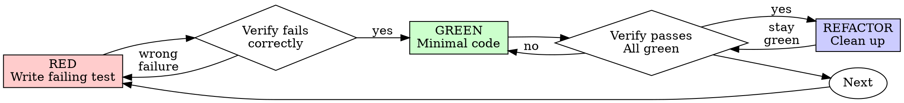

# Build phase

This phase is unrestricted by the PreToolUse hook (source and test files
live outside the change directory), but that only removes the *outer*
gate. The discipline below is the real gate, and it's enforced by you
checking your own work, task by task, plus the build-complete guard's
test-evidence check.

This phase merges two things: task-execution order and progress tracking
against tasks.md (Part 1), and a strict test-driven discipline for how
each task's code gets written (Part 2 — the complete
`superpowers:test-driven-development` skill). Neither replaces the
other — task-execution order without TDD discipline produces code nobody
trusts; TDD discipline without task-execution order produces code that
ignores the plan.

## Part 1 — Executing tasks.md

### Before writing any code

Read tasks.md for the full task list, plan.md for tech stack and file
structure, and spec.md for what each task is actually supposed to
achieve — don't start from tasks.md alone. Execute phase by phase in the
order tasks.md lays out: complete each phase before moving to the next,
run sequential tasks in order, and only run `[P]`-marked tasks together
when they touch different files.

### Classify each task before starting it

Not every task deserves the same amount of up-front thought:

- **Spike-sized** — the task's approach is obvious from tasks.md and
  plan.md. Go straight to Part 2's RED step.
- **Bounded** — there's more than one reasonable way to implement this
  task, or it touches code you haven't read yet. Skim the relevant
  existing code first and settle on an approach in a sentence or two
  before writing the first test.
- **Architectural** — the task implies a design decision plan.md didn't
  already make (a new interface shape, a data model choice with real
  trade-offs). Stop and work out the approach explicitly — state the
  options and which one you're taking and why — before touching any
  code. If the decision is big enough to affect other tasks, surface it
  to the human rather than deciding alone.

The ratchet is one-way: if a task you assumed was bounded turns out to
hide a real design decision, upgrade it to architectural before
proceeding, never downgrade to avoid the extra thought.

### Progress and failure handling

Report progress after each completed task, not just at the end of a
phase. If a non-parallel task fails, halt and report it with enough
context to debug — don't push forward into the next task assuming it'll
sort itself out. For `[P]` tasks, keep going on the ones that succeed and
report the ones that failed; don't let one parallel failure block
unrelated work.

## Part 2 — Test-driven development

**If the `superpowers:test-driven-development` skill is installed in
this environment, invoke it now (Skill tool) and follow it for every
task in this phase — the live skill is authoritative.** The block below
is that skill embedded 1:1 — no edits, no omissions, no reordering —
for environments without the superpowers plugin. Follow the embedded
copy exactly the same way when the live skill is not available. The
appendix after it embeds the skill's `writing-good-tests` reference,
which the target project cannot resolve as a file.

--- begin verbatim embed of superpowers:test-driven-development/SKILL.md ---
# Test-Driven Development (TDD)

## Overview

Write the test first. Watch it fail. Write minimal code to pass.

**Core principle:** If you didn't watch the test fail, you don't know if it tests the right thing.

**Violating the letter of the rules is violating the spirit of the rules.**

## When to Use

**Always:**
- New features
- Bug fixes
- Refactoring
- Behavior changes

**Exceptions (ask your human partner):**
- Throwaway prototypes
- Generated code
- Configuration files

Thinking "skip TDD just this once"? Stop. That's rationalization.

## The Iron Law

```
NO PRODUCTION CODE WITHOUT A FAILING TEST FIRST
```

Write code before the test? Delete it. Start over.

**No exceptions:**
- Don't keep it as "reference"
- Don't "adapt" it while writing tests
- Don't look at it
- Delete means delete

Implement fresh from tests. Period.

## Red-Green-Refactor



### RED - Write Failing Test

Write one minimal test showing what should happen.

<Good>
```typescript
test('retries failed operations 3 times', async () => {
  let attempts = 0;
  const operation = () => {
    attempts++;
    if (attempts < 3) throw new Error('fail');
    return 'success';
  };

  const result = await retryOperation(operation);

  expect(result).toBe('success');
  expect(attempts).toBe(3);
});
```
Clear name, tests real behavior, one thing
</Good>

<Bad>
```typescript
test('retry works', async () => {
  const mock = jest.fn()
    .mockRejectedValueOnce(new Error())
    .mockRejectedValueOnce(new Error())
    .mockResolvedValueOnce('success');
  await retryOperation(mock);
  expect(mock).toHaveBeenCalledTimes(3);
});
```
Vague name, tests mock not code
</Bad>

**Requirements:**
- One behavior
- Clear name
- Real code (no mocks unless unavoidable)

### Verify RED - Watch It Fail

**MANDATORY. Never skip.**

```bash
npm test path/to/test.test.ts
```

Confirm:
- Test fails (not errors)
- Failure message is expected
- Fails because feature missing (not typos)

**Test passes?** You're testing existing behavior. Fix test.

**Test errors?** Fix error, re-run until it fails correctly.

### GREEN - Minimal Code

Write simplest code to pass the test.

<Good>
```typescript
async function retryOperation<T>(fn: () => Promise<T>): Promise<T> {
  for (let i = 0; i < 3; i++) {
    try {
      return await fn();
    } catch (e) {
      if (i === 2) throw e;
    }
  }
  throw new Error('unreachable');
}
```
Just enough to pass
</Good>

<Bad>
```typescript
async function retryOperation<T>(
  fn: () => Promise<T>,
  options?: {
    maxRetries?: number;
    backoff?: 'linear' | 'exponential';
    onRetry?: (attempt: number) => void;
  }
): Promise<T> {
  // YAGNI
}
```
Over-engineered
</Bad>

Don't add features, refactor other code, or "improve" beyond the test.

### Verify GREEN - Watch It Pass

**MANDATORY.**

```bash
npm test path/to/test.test.ts
```

Confirm:
- Test passes
- Other tests still pass
- Output pristine (no errors, warnings)

**Test fails?** Fix code, not test.

**Other tests fail?** Fix now.

### REFACTOR - Clean Up

After green only:
- Remove duplication
- Improve names
- Extract helpers

Keep tests green. Don't add behavior.

### Repeat

Next failing test for next feature.

## Good Tests

| Quality | Good | Bad |
|---------|------|-----|
| **Minimal** | One thing. "and" in name? Split it. | `test('validates email and domain and whitespace')` |
| **Clear** | Name describes behavior | `test('test1')` |
| **Shows intent** | Demonstrates desired API | Obscures what code should do |

When writing or changing any test, read [writing-good-tests.md](writing-good-tests.md) for the rules that keep tests honest:
- Name the production change that would make the test fail — before writing it
- Assert on real behavior, never on mock behavior
- Keep test-only code in test utilities, out of production classes
- Understand a dependency's side effects before mocking it

## Common Rationalizations

| Excuse | Reality |
|--------|---------|
| "Too simple to test" | Simple code breaks. Test takes 30 seconds. |
| "I'll test after" | Tests written after pass immediately — which proves nothing. They may test the wrong thing, test the implementation instead of the behavior, or miss the edge case you forgot. You never watched it fail, so you never proved it can catch the bug. Test-first forces that failure. |
| "Tests after achieve same goals (spirit not ritual)" | Tests-after answer "what does this do?"; tests-first answer "what should this do?" Tests written after are biased by the code you already wrote — you verify the cases you remembered, not the ones you'd have discovered. Coverage without proof the tests work. |
| "Already manually tested" | Manual testing is ad-hoc: no record of what you covered, no way to re-run it when the code changes, easy to forget cases under pressure. "Worked when I tried it" ≠ comprehensive. Automated tests run the same way every time. |
| "Deleting X hours is wasteful" | Sunk cost fallacy — that time is already spent either way. The real choice: rewrite with TDD (high confidence) vs. keep it and bolt tests on after (low confidence, likely bugs). Keeping code you can't trust is the waste. |
| "Keep as reference, write tests first" | You'll adapt it. That's testing after. Delete means delete. |
| "Need to explore first" | Fine. Throw away exploration, start with TDD. |
| "Test hard = design unclear" | Listen to test. Hard to test = hard to use. |
| "TDD will slow me down" | TDD IS the pragmatic path: catches bugs before commit, prevents regressions, lets you refactor without fear. "Pragmatic" shortcuts mean debugging in production — slower, not faster. |
| "Manual test faster" | Manual doesn't prove edge cases. You'll re-test every change. |
| "Existing code has no tests" | You're improving it. Add tests for existing code. |

## Red Flags - STOP and Start Over

- Code before test
- Test after implementation
- Test passes immediately
- Can't explain why test failed
- Tests added "later"
- Rationalizing "just this once"
- "I already manually tested it"
- "Tests after achieve the same purpose"
- "It's about spirit not ritual"
- "Keep as reference" or "adapt existing code"
- "Already spent X hours, deleting is wasteful"
- "TDD is dogmatic, I'm being pragmatic"
- "This is different because..."

**All of these mean: Delete code. Start over with TDD.**

## Example: Bug Fix

**Bug:** Empty email accepted

**RED**
```typescript
test('rejects empty email', async () => {
  const result = await submitForm({ email: '' });
  expect(result.error).toBe('Email required');
});
```

**Verify RED**
```bash
$ npm test
FAIL: expected 'Email required', got undefined
```

**GREEN**
```typescript
function submitForm(data: FormData) {
  if (!data.email?.trim()) {
    return { error: 'Email required' };
  }
  // ...
}
```

**Verify GREEN**
```bash
$ npm test
PASS
```

**REFACTOR**
Extract validation for multiple fields if needed.

## Verification Checklist

Before marking work complete:

- [ ] Every new function/method has a test
- [ ] Watched each test fail before implementing
- [ ] Each test failed for expected reason (feature missing, not typo)
- [ ] Wrote minimal code to pass each test
- [ ] All tests pass
- [ ] Output pristine (no errors, warnings)
- [ ] Tests use real code (mocks only if unavoidable)
- [ ] Edge cases and errors covered

Can't check all boxes? You skipped TDD. Start over.

## When Stuck

| Problem | Solution |
|---------|----------|
| Don't know how to test | Write wished-for API. Write assertion first. Ask your human partner. |
| Test too complicated | Design too complicated. Simplify interface. |
| Must mock everything | Code too coupled. Use dependency injection. |
| Test setup huge | Extract helpers. Still complex? Simplify design. |

## Debugging Integration

Bug found? Write failing test reproducing it. Follow TDD cycle. Test proves fix and prevents regression.

Never fix bugs without a test.

## Final Rule

```
Production code → test exists and failed first
Otherwise → not TDD
```

No exceptions without your human partner's permission.
--- end verbatim embed of superpowers:test-driven-development/SKILL.md ---

--- begin verbatim embed of superpowers:test-driven-development/writing-good-tests.md (appendix) ---
# Writing Good Tests

**Load this reference when:** writing or changing tests, adding mocks, or
adding cleanup/helper methods for tests.

## Overview

A test exists to catch a specific break. Two principles govern everything
here:

```
1. Every test names the break it catches
2. Every test exercises the real thing
```

Strict TDD produces both naturally: a test written first and watched
failing against real code has already proven it can fail, and only earns
a mock when the real dependency proves slow or external.

## Principle 1: Name the Break

Before writing the test body, answer: **what production change should
make this test fail — and is that change a bug or a decision?** A test
earns its place by catching a wrong branch, missing side effect, wrong
argument, boundary case, or broken contract.

**Derive expectations independently.** Use literals and hand-checked
fixtures; table-driven tests with literal `want` values are the preferred
shape. An expectation computed by the code under test — or its helpers —
passes no matter what that code does:

```typescript
// ❌ Mirror assertion: the same builder computes both sides — always true
const expected = buildSearchQuery({ tag: 'urgent' });
expect(buildSearchQuery({ tag: 'urgent' })).toBe(expected);

// ✅ Hand-derived literal
expect(buildSearchQuery({ tag: 'urgent' })).toBe('tag:"urgent"');
```

**No change detectors.** If only intentional decisions can fail a test —
a constant's value, exact message wording, private structure — it fires
on redesign and sleeps through bugs. Test the behavior that depends on
the decision: not `expect(MAX_RETRIES).toBe(5)` but "a failing call is
retried 5 times and the 6th attempt never happens."

**Behavior, not text.** Asserting that a script, skill, or config
contains an exact line proves only that the source is the source. Run
scripts against controlled inputs and assert outputs, side effects, or
exit codes. Documents that instruct agents are tested by the consuming
agent's behavior (superpowers:writing-skills); prose for humans earns no
test at all.

**Your code, not the framework.** Test the contract your code makes at
its boundaries — the route you register, the query you emit, the payload
you produce. Upstream mechanics are their maintainers' tests to write
(the classic: asserting your router invokes a registered handler — that
is the framework's test, not yours). When upstream behavior genuinely
surprised you, write one narrow characterization test naming the
assumption. The same boundary applies inside your code: constructors,
getters, constants, and trivial forwarding earn tests only when they
validate, normalize, default, derive, enforce, or cause side effects —
otherwise assert the first consumer-visible result that depends on them.

### Gate Function

```
BEFORE writing the test body:
  Name the production change that would make this test fail.

  Cannot name one            → redesign around an observable behavior
  "The source text changed"  → run the artifact and assert its effects
  Only intentional decisions → change detector; test the behavior
                               that depends on the decision

  Confirm the expected value is derived without the code under test.
  IF it reuses the code's logic or helpers:
    Replace it with a literal or hand-checked fixture
```

## Principle 2: Exercise the Real Thing

**The mock earns no assertions.** A mock assertion passes when the mock
is present and fails when it is absent — it says nothing about the
component. Assert the real component's behavior; if the mock is what you
are checking, unmock it or delete the assertion.

```typescript
// ✅ Real behavior
expect(screen.getByRole('navigation')).toBeInTheDocument();

// ❌ Mock existence
expect(screen.getByTestId('sidebar-mock')).toBeInTheDocument();
```

**your human partner's correction:** "Are we testing the behavior of a
mock?"

**Mock at the right level.** Learn every side effect of the real method
before replacing it; mock the slow or external operation and keep what
the test depends on real. When unsure, run the test against the real
implementation first and observe what actually needs to happen.

```typescript
// ❌ The mock swallows the config write that duplicate detection reads
vi.mock('ToolCatalog', () => ({
  discoverAndCacheTools: vi.fn().mockResolvedValue(undefined)
}));

// ✅ Mock only the slow server startup; the config write stays real
vi.mock('MCPServerManager');
```

**Make doubles specific.** When arguments, call counts, or ordering are
part of the contract, assert them — a fake that accepts anything verifies
nothing. Give each branch (success, error, malformed) its own fixture or
spy, so the wrong branch cannot satisfy the expectation.

**Mirror real data completely.** Mock the complete structure as it exists
in reality — all documented fields — not just the ones your test reads.
Partial mocks fail silently when downstream code reads an omitted field:
the test passes while integration breaks.

**Production classes carry production methods only.** Cleanup that only
tests need lives in test utilities, never as a `destroy()` on the
production class. Ask: is this method called only from tests? Does this
class own this resource's lifecycle? Wrong answers → test utility.

**Prefer real components over complex mocks.** When mock setup outgrows
the test logic, mocks miss methods the real components have, or tests
break when the mock changes, switch to an integration test with real
components. **your human partner's question:** "Do we need to be using a
mock here?"

### Gate Function

```
BEFORE adding a mock or test helper:
  List the real method's side effects; keep the ones the test
  depends on real — mock the slow/external level below them.

  Mock responses mirror the complete real structure.

  A method only tests call lives in test utilities, not production.

  About to assert on the mock itself?
    Unmock it or delete the assertion.
```

## Tests Ship With the Implementation

The TDD cycle — failing test, minimal implementation, refactor — is what
"complete" means. Ship the tests the behavior needs and only those:
trivial code and human prose earn none, and a test written to satisfy
process costs maintenance forever.

## The Mutation Check

Before finishing, mentally mutate the production code; at least one test
should fail for each realistic mutation:

- Wrong constant or argument
- Wrong branch handler
- Missing state change or side effect
- Empty or default return
- Missing validation for zero, empty, nil, unauthorized, or malformed input

A mutation nothing catches marks the behavior as unprotected — or the
test as tautological.

## Quick Reference

| When you... | Do |
|-------------|-----|
| Write any test | Name the break it catches — a bug, not a decision |
| Build an expected value | Derive it by hand; never with the code under test |
| Test a script or document | Run it / pressure-test its consumer; never grep its text |
| Reach for a dependency test | Test your boundary contract, not their documented mechanics |
| Want to assert on a mocked element | Test the real component, or unmock it |
| Are about to mock a method | Learn its side effects; mock the slow/external level |
| Build a mock response | Mirror the real structure completely |
| Need cleanup only tests use | Put it in test utilities |
| Watch mock setup balloon | Switch to an integration test with real components |
| Finish a test file | Run the mutation check |

## Warning Signs

- Setup and assertion share the same object, guaranteeing equality
- The test can fail only through a panic, crash, or missing selector
- The test fails on every intentional change, never on accidental breakage
- Expected values are hidden behind loops, builders, or helpers
- The test greps source text, or asserts a removed symbol stays removed
- The test would still matter if only the framework remained
- The test exists for coverage, checking no side effect or outcome
- An assertion checks a `*-mock` test ID, or fails if you remove the mock
- A method is called only from test files
- Mock setup is more than half the test, or you can't explain why the mock is needed
- Mocking "just to be safe"
--- end verbatim embed of superpowers:test-driven-development/writing-good-tests.md (appendix) ---

## Test evidence in tasks.md

The red-green cycle above must leave a trace in tasks.md. When you check
off a task, immediately append an evidence line directly beneath it:

```
- [x] T002 [US1] Implement Add in internal/gatecheck/gatecheck.go
  - tests: internal/gatecheck/gatecheck_test.go TestAdd
```

A task that legitimately has no test (docs, config, scaffolding) is
marked `[no-test]` on its task line instead. The build-complete guard
rejects any checked task whose next non-blank line isn't its evidence
line — but the guard verifies the trace was left, not that the cycle was
honestly run. Evidence without a test that actually failed first defeats
the whole point; don't fabricate it.

## Delegating exploration

If a task requires searching or reading through a lot of unfamiliar code
before you can write the first test, delegate that exploration to a
subagent and have it report back only concrete `path:line` citations, not
full file dumps — keep your own context focused on the task's tests and
implementation, not on search noise. Exploration is throwaway: once you
know the approach, start the task's RED step with no code written.

## Advancing out of this phase

Only once every checkbox in tasks.md is checked:

```
mulix state transition build-complete
```

The guard counts unchecked boxes in tasks.md *and* checks the TDD
evidence trail (every checked task carries a `- tests:` line or a
`[no-test]` marker). The evidence trail is the floor, not the ceiling —
the discipline itself is Part 2, followed task by task.
